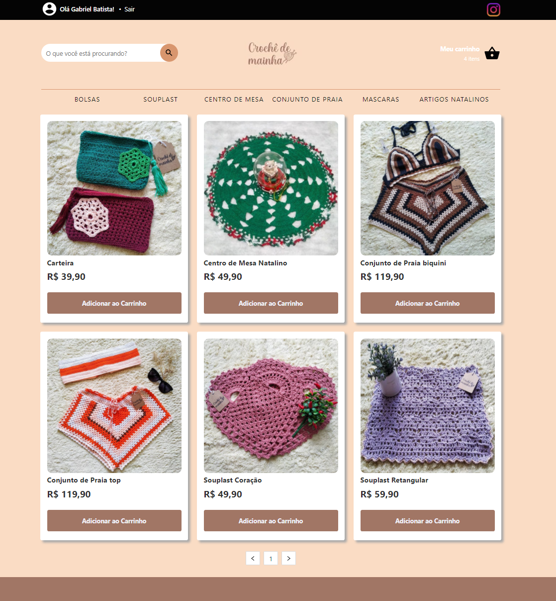
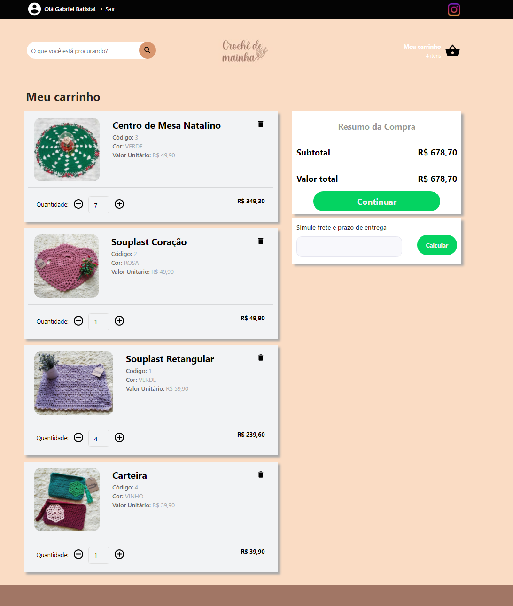
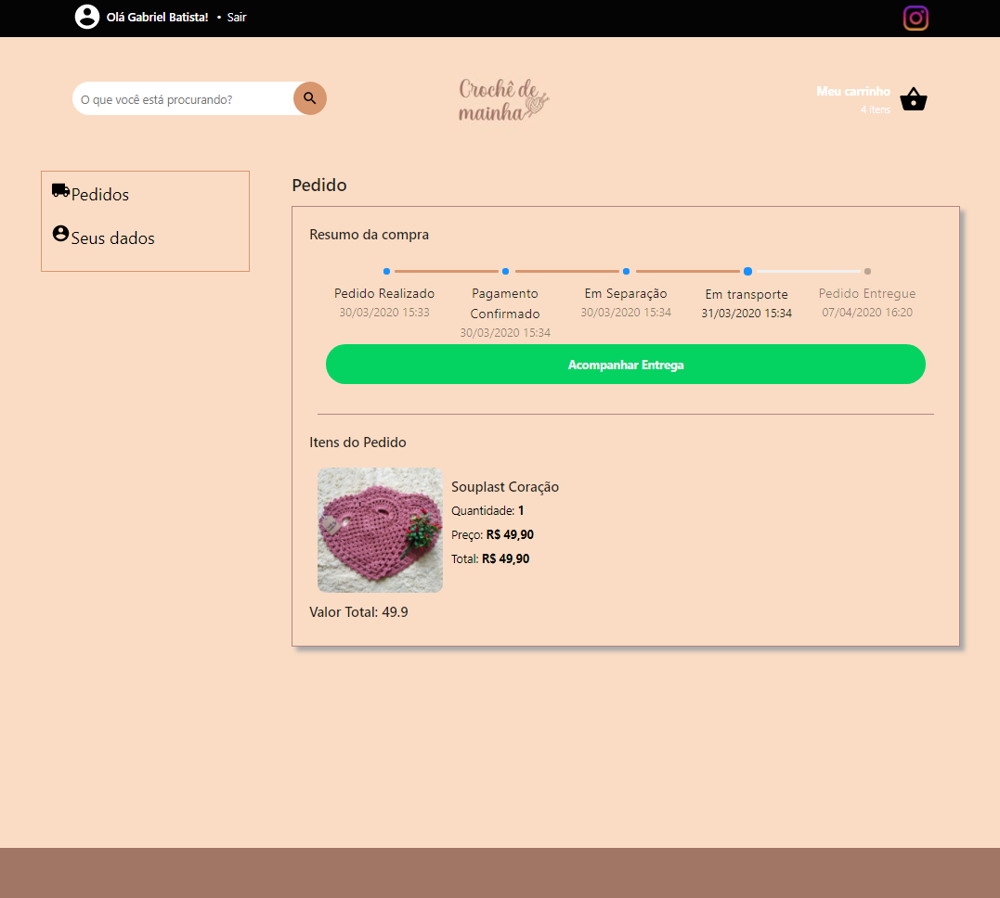

## 💻 Projeto

Projeto de E-commerce para produtos de crochê.

<h1 align="center">
    
</h1>

<h1 align="center">
    
</h1>

<h1 align="center">
    
</h1>


## :rocket: Tecnologias

Esse projeto foi desenvolvido com as seguintes tecnologias:

- [TypeScript][typescript]
- [React][reactjs]

## :information_source: How To Use

Para clonar e rodar essa aplicação, você vai precisar do [Git](https://git-scm.com), [Node.js][nodejs] + [Yarn][yarn] installed on your computer.

### Instalação

```bash
# Clone this repository
$ git clone https://github.com/ggondimrb/croche-frontend
# Go into the repository
$ cd croche-frontend
# Install dependencies
$ yarn install
# Run
$ yarn start
# running on port 3000
```

[yarn]: https://yarnpkg.com/
[nodejs]: https://nodejs.org/
[typescript]: https://www.typescriptlang.org/
[reactjs]: https://reactjs.org
